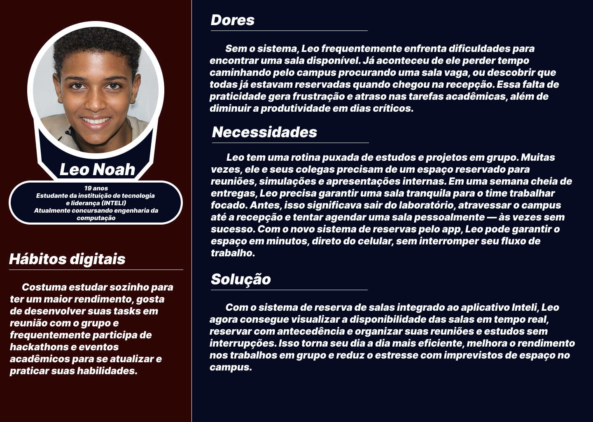

# Web Application Document - Projeto Individual - Módulo 2 - Inteli

**_Os trechos em itálico servem apenas como guia para o preenchimento da seção. Por esse motivo, não devem fazer parte da documentação final._**

## Extenção para o app Inteli (Sistema de reserva de salas para agendamentos.)

#### **Autor:** Arthur Marques de Almeida

## Sumário

1. [Introdução](#c1)  
2. [Visão Geral da Aplicação Web](#c2)  
3. [Projeto Técnico da Aplicação Web](#c3)  
4. [Desenvolvimento da Aplicação Web](#c4)  
5. [Referências](#c5)  

 

## 1. Introdução 
O sistema que será desenvolvido é uma nova função dentro do aplicativo Inteli, já usado pelos alunos para gerar o QR Code de entrada na faculdade e fazer o check-in. A ideia é dar ainda mais autonomia para os alunos, criando uma ferramenta para que eles possam reservar as salas de estudo do campus de forma prática e rápida.

Hoje, o processo de reserva é pouco conhecido e pouco acessível: é preciso ir pessoalmente até a recepção para agendar uma sala, sem ter como consultar antes quais estão disponíveis. Com essa nova função, o aluno poderá ver pelo app quais salas estão livres, escolher o melhor horário e fazer a reserva sem sair do lugar.

Além disso, será possível acompanhar todas as reservas feitas, cancelar se precisar e receber alertas sobre as próximas reservas. Isso vai facilitar muito o dia a dia dos alunos, que poderão planejar melhor seus estudos e usar os espaços disponíveis da faculdade de forma mais organizada.

O objetivo principal é trazer mais praticidade, melhorar a comunicação sobre a disponibilidade das salas e tornar o uso do campus mais eficiente para todos. Dessa forma, o Inteli se torna ainda mais útil para o dia a dia acadêmico.

---

## 2. Visão Geral da Aplicação Web

  Persona 
  

### 2.2. User Stories 

**(US01)**  
Como aluno, quero visualizar a lista de salas disponíveis para reserva, para escolher uma sala livre que atenda às minhas necessidades.

**(US02)**  
Como professor, quero realizar a reserva de uma sala diretamente pelo aplicativo, para garantir um espaço adequado para ministrar aulas extras, reuniões ou atividades acadêmicas.

**(US03)**  
Como aluna, quero receber notificações de confirmação e lembrete das minhas reservas, para não esquecer dos horários e gerenciar melhor meu tempo.

**(US04)**  
Como administrador da faculdade, quero gerenciar (aprovar, cancelar ou alterar) reservas feitas pelos alunos, para manter o controle do uso das salas e resolver conflitos de agendamento.

## Analise INVEST do US02 (professor)
**(US02)**  
Como professor, quero realizar a reserva de uma sala diretamente pelo aplicativo, para garantir um espaço adequado para ministrar aulas extras, reuniões ou atividades acadêmicas.

**I (Independente):**
Pode ser implementada separadamente das outras funcionalidades, como visualização de salas ou envio de notificações.

**N (Negociável):**
A forma como o professor realiza a reserva (ex: escolha de tipo de sala, aprovação automática ou manual) pode ser ajustada de acordo com as necessidades da faculdade.

**V (Valiosa):**
Permite que o professor tenha autonomia para planejar atividades acadêmicas sem depender do atendimento presencial, agilizando processos e otimizando o uso dos espaços.

**E (Estimável):**
A funcionalidade é bem definida (escolher sala, data, horário, quem estará presente, confirmar reserva) e pode ser facilmente estimada em termos de esforço de desenvolvimento.

**S (Small - Pequena):**
É pequena o bastante para ser desenvolvida e entregue em uma sprint de duração padrão, principalmente se focar inicialmente em um fluxo simples de reserva.

**T (Testável):**
Pode ser testada facilmente, verificando se o professor consegue selecionar uma sala e completar uma reserva pelo aplicativo.

---

## 3. Projeto da Aplicação Web

### 3.1. Modelagem do banco de dados  (Semana 3)

*Posicione aqui os diagramas de modelos relacionais do seu banco de dados, apresentando todos os esquemas de tabelas e suas relações. Utilize texto para complementar suas explicações, se necessário.*

*Posicione também o modelo físico com o Schema do BD (arquivo .sql)*

### 3.1.1 BD e Models (Semana 5)
*Descreva aqui os Models implementados no sistema web*

### 3.2. Arquitetura (Semana 5)

*Posicione aqui o diagrama de arquitetura da sua solução de aplicação web. Atualize sempre que necessário.*

**Instruções para criação do diagrama de arquitetura**  
- **Model**: A camada que lida com a lógica de negócios e interage com o banco de dados.
- **View**: A camada responsável pela interface de usuário.
- **Controller**: A camada que recebe as requisições, processa as ações e atualiza o modelo e a visualização.
  
*Adicione as setas e explicações sobre como os dados fluem entre o Model, Controller e View.*

### 3.3. Wireframes (Semana 03)

*Posicione aqui as imagens do wireframe construído para sua solução e, opcionalmente, o link para acesso (mantenha o link sempre público para visualização).*

### 3.4. Guia de estilos (Semana 05)

*Descreva aqui orientações gerais para o leitor sobre como utilizar os componentes do guia de estilos de sua solução.*

### 3.5. Protótipo de alta fidelidade (Semana 05)

*Posicione aqui algumas imagens demonstrativas de seu protótipo de alta fidelidade e o link para acesso ao protótipo completo (mantenha o link sempre público para visualização).*

### 3.6. WebAPI e endpoints (Semana 05)

*Utilize um link para outra página de documentação contendo a descrição completa de cada endpoint. Ou descreva aqui cada endpoint criado para seu sistema.*  

### 3.7 Interface e Navegação (Semana 07)

*Descreva e ilustre aqui o desenvolvimento do frontend do sistema web, explicando brevemente o que foi entregue em termos de código e sistema. Utilize prints de tela para ilustrar.*

---

## 4. Desenvolvimento da Aplicação Web (Semana 8)

### 4.1 Demonstração do Sistema Web (Semana 8)

*VIDEO: Insira o link do vídeo demonstrativo nesta seção*
*Descreva e ilustre aqui o desenvolvimento do sistema web completo, explicando brevemente o que foi entregue em termos de código e sistema. Utilize prints de tela para ilustrar.*

### 4.2 Conclusões e Trabalhos Futuros (Semana 8)

*Indique pontos fortes e pontos a melhorar de maneira geral.*
*Relacione também quaisquer outras ideias que você tenha para melhorias futuras.*

## 5. Referências

_Incluir as principais referências de seu projeto, para que seu parceiro possa consultar caso ele se interessar em aprofundar. Um exemplo de referência de livro e de site:_ 

---
---